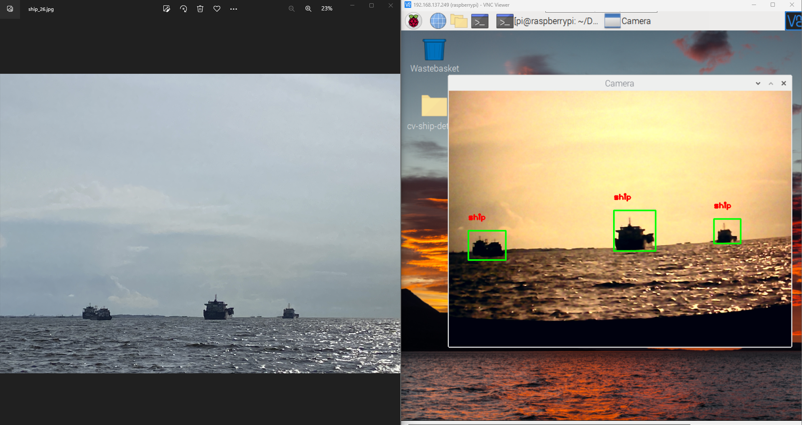

# Ship Object Detaction

Computer vision project from Mapua to detect ship in a harbor ported in Raspberry Pi connected to AWS and have desktop application for monitoring.

The folder `darknet_yolov4_tiny_setup` contains the setup files needed for training and running the darknet YOLOv4 Tiny object detection and uploading the detected images in the cloud. This folder contains the setup files to be merged in the actual darknet setup only, not the whole darknet setup.

The folder `desktop_monitoring`contains the desktop application for monitoring the detected ships. 


## Languages and tools used:
- Python
- PyQt5
- AWS S3
- Darknet, YOLOv4 Tiny
- Raspberry Pi 4
- NodeMCU


## General setup on Windows:
To run this, clone this repository on your desktop computer and create a virtual environment inside the cloned repository by following the commands below in your CLI. This assumes you already have Python and pip installed.
```
pip install virtualenv
virtualenv my-venv
```
Activate the virtual environment for Windows by:
```
my-env\Scripts\activate
```
Then install the required Python packages:
```
pip install -r requirements.txt
```

## Setting up and running the desktop application on Windows:
- Change the directory to `desktop_monitoring` and run the command:
```
python monitoring.py
```
- This will open a GUI that shows the recent image detected and log history.
- If you need to run this again, just activate the virtual environment and run `monitoring.py` again.


## Setting up and running YOLOv4 Tiny object detector on Windows or Raspberry Pi:
- You can do this either in Windows or Raspberry Pi. 
- If you're on Raspberry Pi, follow the general setup above. The only difference is you need to activate the virtual environment using the command:
```
my-env\Scripts\activate
```
- Make sure a webcam is connected to Raspberry Pi before running the program.
- If you'll run this on Windows alongside with the desktop application, open another CLI, activate the virtual environment then change the directory to `darknet_yolov4_tiny_setup` and run the command:
```
python detect.py
```
- This should open a window showing the webcam stream.
- Note that if you have multiple webcams in your computer, you have to modify ```detect.py``` on line 45.
```
cap = cv2.VideoCapture(0)
```
- 0 means you'll use the only available webcam in your computer, if you have multiple webcams installed, just change it to 1. Just keep incrementing it depending on the number of webcam connected in your computer.


## Sample output:
- Put a ship image on the front of your computer's webcam.
- The program will upload the detected ship every certain interval.
- The desktop application should automatically display the recent image detected once it is detected after a few seconds.

If you run this on a desktop computer, modify `darknet_yolov4_tiny_setup/detect.py` on line 47 to:
```
target_iteration = 100
```
Else, if you are on Raspberry Pi:
```
target_iteration = 10
```

### Windows:

You should have the same setup as below, I just point my webcam on my phone with an image of the ship in it.


### Raspberry Pi:
- The same thing should happen if you'll run the object detector in the Raspberry Pi. 
- I started the program by connecting the Raspberry Pi to a VNC Server.
- I just pointed again the USB camera connected to Raspberry Pi into an image in my desktop computer.



## Possible problems:
- One drawback of running object detection in Raspberry Pi is that it has a low FPS, even if we use the tiny version of YOLOv4. This can be solved in the future by using a compute stick or use another development board optimized for deep learning such as Nvidia Jetson Nano.
- The detection will only be good if the image quality is also good. The camera should be clear and properly focused. As you can see in the images above, the output of the camera I used is brownish. Make sure to calibrate the camera to capture good frames before using the program.
- The model here was mainly trained on medium - far ship images. If it doesn't detect a clear image of a near ship we need to retrain it with more datasets.


