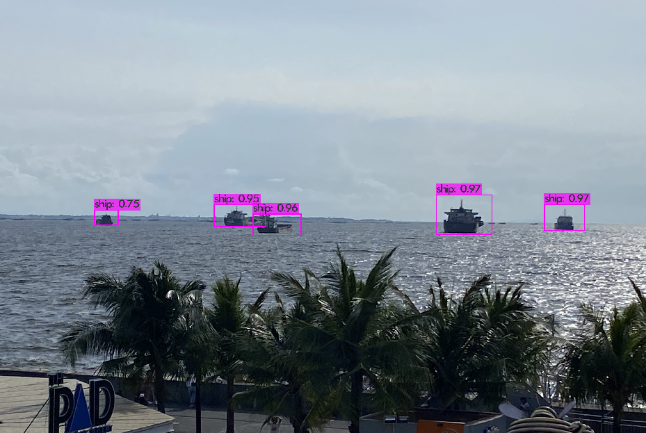
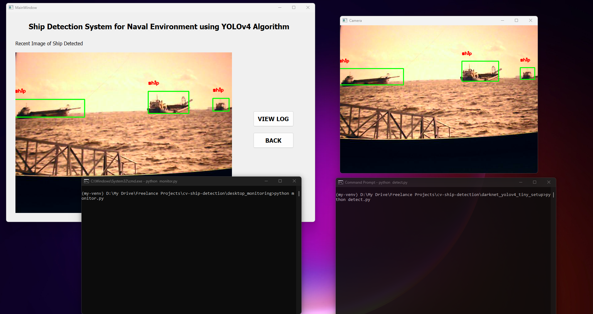

# Research Project - Ship Detection System for Naval Environment using YOLOv4 Algorithm

Deep learning and IoT-based project for detection and monitoring of ships.

The folder `darknet_yolov4_tiny_setup` contains the setup files needed for training and running the darknet YOLOv4 Tiny object detection and uploading the detected images in the cloud. This folder contains the setup files to be merged in the actual darknet setup only, not the whole darknet setup.

The folder `desktop_monitoring`contains the desktop application for monitoring of the detected ships. This is supposed to be run on desktop computer only.



## Languages and tools used:
- Python
- PyQt5
- AWS S3
- Darknet, YOLOv4 Tiny
- Raspberry Pi 4
- NodeMCU


## General setup on Windows:
To run this, clone this repository on your desktop computer and create a virtual environment inside the cloned repository by following the commands below in your CLI. This assumes you already have Python and pip installed.
```
pip install virtualenv
virtualenv my-venv
my-env/Scripts/activate
pip install -r requirements.txt
```

## Setting up and running the desktop application on Windows:
- Change directory to `desktop_monitoring` and run the command:
```
python monitoring.py
```
- This will open a GUI that shows the recent image detected and log history.
- If you need to run this again, just activate the virtual environment and run `monitoring.py` again.


## Setting up and running YOLOv4 Tiny object detector on Windows or Raspberry Pi:
- You can do this either in Windows or Raspberry Pi. 
- If you're on Raspberry Pi, follow the general setup above. Make sure# Research Project - Ship Detection System for Naval Environment using YOLOv4 Algorithm

Deep learning and IoT-based project for detection and monitoring of ships.

The folder `darknet_yolov4_tiny_setup` contains the setup files needed for training and running the darknet YOLOv4 Tiny object detection and uploading the detected images in the cloud. This folder contains the setup files to be merged in the actual darknet setup only, not the whole darknet setup.

The folder `desktop_monitoring`contains the desktop application for monitoring the detected ships. This is supposed to be run on a desktop computer only.


## Languages and tools used:
- Python
- PyQt5
- AWS S3
- Darknet, YOLOv4 Tiny
- Raspberry Pi 4
- NodeMCU


## General setup on Windows:
To run this, clone this repository on your desktop computer and create a virtual environment inside the cloned repository by following the commands below in your CLI. This assumes you already have Python and pip installed.
```
pip install virtualenv
virtualenv my-venv
my-env/Scripts/activate
pip install -r requirements.txt
```

## Setting up and running the desktop application on Windows:
- Change the directory to `desktop_monitoring` and run the command:
```
python monitoring.py
```
- This will open a GUI that shows the recent image detected and log history.
- If you need to run this again, just activate the virtual environment and run `monitoring.py` again.


## Setting up and running YOLOv4 Tiny object detector on Windows or Raspberry Pi:
- You can do this either in Windows or Raspberry Pi. 
- If you're on Raspberry Pi, follow the general setup above. Make sure a webcam is connected to Raspberry Pi before running the program.
- If you'll run this on Windows alongside with the desktop application, open another CLI then; change the directory to `darknet_yolov4_tiny_setup` and run the command:
```
python detect.py
```

## Sample output:
- Put a ship image on the front of your computer's webcam.
- The program will upload the detected ship every certain interval.
- The desktop application should automatically display the recent image detected once it is detected after a few seconds.

You should have the same setup as below, I just point my webcam on my phone with an image of the ship in it.



The same thing should happen if you'll run the object detector in the Raspberry Pi.

## Possible problems:
- One drawback of running object detection in Raspberry Pi is that it has a low FPS, even if we use the tiny version of YOLOv4. This can be solved in the future by using a compute stick or use another development board optimized for deep learning such as Nvidia Jetson Nano.
- The detection will only be good if the image quality is also good. The camera should be clear.
- The model here was mainly trained on medium - far ship images. If it doesn't detect a clear image of a near ship we need to retrain it with more datasets.


 a webcam is connected to Raspberry Pi before running the program.
- If you'll run this on Windows along side with the desktop application, open another CLI then; change directory to `darknet_yolov4_tiny_setup` and run the command:
```
python detect.py
```

## Sample output:
- Put a ship image on front of your computer's webcam.
- The program will upload the detected ship every certain interval.
- The desktop application should automatically display the recent image detected once it is detected after a few seconds.

You should have the same setup like below, I just point my webcam on my phone with image of the ship in it.


Same thing should happen if you'll run the object detector in the Raspberry Pi so the desktop app is the only one running in your desktop computer. 

## Possible problems:
- One drawback of running the object detection in Raspberry Pi is that it has a low FPS, even of we use the tiny version of YOLOv4. This can be solved in the future by using a compute stick or use another development board optimized for deep learning such as Nvidia Jetson Nano.
- The detection will only be good if the image quality is also good. The camera should be clear.
- The model here was mainly trained on medium - far ship images. If it doesn't detect a near clear ship we need to retrain it with more dataset.


